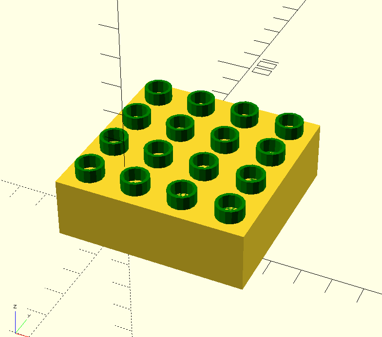

# openscad-libraries
Personal libraries for [OpenSCAD](https://openscad.org/)

# Dependencies

### BOSL2
I've included [BOSL2](https://github.com/BelfrySCAD/BOSL2) in this repository for convenience. I've read that their releases aren't the easiest to follow due to a lack of semantic versioning. If you already have the BOSL2 library, you may not need to download the copy in this repo unless you experience errors.

# Dominoes
This library creates all permutations of a standard domino.

| parameter | default | description |
|-|-|-|
| `block` | `[0, 0]` | This creates a block with the given number of pips per half. |
| `dimensions` | `[24, 24 * 2, 24 / 3]` | Customizes the shape of the block. Defaults to a "standard" size domino. |
| `pip_radius` | `24 / 15` | Customizes the pip hole size |

#### Example
```
include <domino.scad>
// all permutations of a domino
for (y = [0:1:6]) {
    for (x = [0:1:6]) {
        move([x * 25, y * 50, 0]) domino([x,y]);
    }
}
```


# Stackable Blocks
This library creates stackable blocks.

## block.scad
| parameter | default | description |
|-|-|-|
| `dimensions` | `[31.5, 31.5, 19.1]` | Customizes the block's dimensions |
| `wall_thickness` | `1.3` | Customizes the block's wall thickness |
| `peg_height` | `4.5` | Customizes the peg's height |
| `peg_diameter` | `9.3` | Customizes the peg's diameter |
| `peg_spacing` | `15.75` | Customizes the peg's space between each other |
| `underside_tube_diameter` | `13.1` | Customizes the underside tube's diameter |
| `underside_spine_length` | `2` | Customizes the underside spines' length |
| `underside_spine_thickness` | `1` | Customizes the underside spines' thickness |
| `underside_spine_distance_from_center` | `8` | Customizes the underside spines' distance from center |

#### Example
```
include <stackable-block/block.scad>
// blocks
width = 31.5;
for (x = [0:1:1]) {
    for (y = [0:1:1]) {
        move([x*width,y*width,0]) block();
    }
}
```

