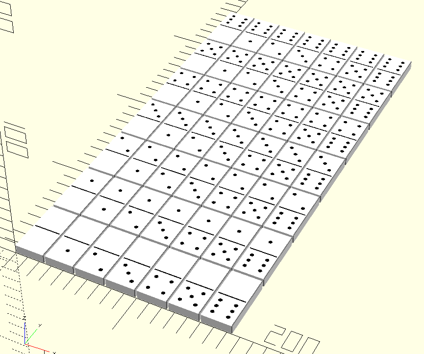

# openscad-libraries
Personal libraries for OpenSCAD

# Dependencies

### BOSL2
I've included [BOSL2](https://github.com/BelfrySCAD/BOSL2) in this repository for convenience. I've read that their releases aren't the easiest to follow due to a lack of semantic versioning. If you already have the BOSL2 library, you may not need to download the copy in this repo unless you experience errors.

# Dominoes
This library creates all permutations of a standard domino.

| parameter | default | description |
|-|-|-|
| `block` | `[0, 0]` | This creates a block with the given number of pips per half. |
| `dimensions` | `[24, 24 * 2, 24 / 3]` | Customizes the shape of the block. Defaults to a "standard" size domino. |
| `pip_radius` | `24 / 15` | Customizes the pip hole size |

#### Example
```
include <domino.scad>
// all permutations of a domino
for (y = [0:1:6]) {
    for (x = [0:1:6]) {
        move([x * 25, y * 50, 0]) domino([x,y]);
    }
}
```

